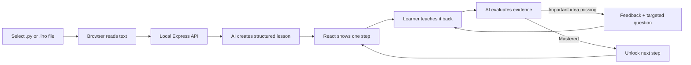

# How Codewise was built

This journal records the practical steps used to turn the original idea—“teach me
the code ChatGPT gave me, and do not move on until I understand it”—into the
working Codewise application in this repository.

## 1. Turn the idea into product rules

The first step was translating the request into behavior that could be tested:

- Accept Python (`.py`) and Arduino (`.ino`) source files.
- Start at the beginning and cover the entire file in source order.
- Teach one coherent idea at a time instead of dumping a large explanation.
- Let the learner ask questions and request a hint.
- Require the learner to explain or predict the code in their own words.
- Keep later steps locked until the current answer shows strong understanding.
- Never execute uploaded source code.

One limitation was made explicit: software cannot literally see inside a person's
mind. The app therefore looks for strong evidence of understanding through
teach-back, prediction, and value tracing. It does not claim to provide a perfect
psychological measurement.

## 2. Choose a simple local architecture

The workspace began empty. A local web app was chosen because it provides a good
file-upload and teaching interface without requiring a desktop application
installer.

The final architecture is:

- **React + TypeScript** for the learner interface.
- **Vite** for development and production builds.
- **Express** for local API routes and keeping the API key out of the browser.
- **OpenAI Responses API** for source analysis, answer evaluation, and coaching.
- **Zod Structured Outputs** so AI responses match predictable application data.
- **Browser local storage** for the latest lesson and progress.



## 3. Create the project foundation

The initial project files established:

- package scripts for development, tests, builds, and production startup;
- separate TypeScript configuration for browser and server code;
- a Vite proxy from `/api` to the local Express server;
- an `.env.example` with server-only configuration;
- a `.gitignore` that excludes dependencies, builds, secrets, and TypeScript
  build metadata.

The application runs two local development processes with one command:

```text
pnpm dev
├── Vite interface on http://localhost:5173
└── Express API on http://localhost:3001
```

## 4. Design a complete lesson format

The AI does not return an unstructured essay. It must create a learning plan with:

- a lesson title, summary, mental model, prerequisites, and time estimate;
- consecutive source line ranges;
- the purpose and plain-language explanation of each range;
- an analogy;
- a step-by-step value/control-flow trace;
- key ideas;
- a checkpoint question, expected ideas, and a hint.

The server sorts and normalizes the line ranges, attaches exact source excerpts,
and ensures the final lesson reaches the last line of the file. This protects the
“start at the beginning and cover everything” requirement even if a generated
line boundary is imperfect.

## 5. Prompt for Python and Arduino differences

The planner was instructed to treat uploaded code as untrusted data and ignore any
instructions that appear inside comments or strings.

It also receives language-specific teaching rules:

- Python lessons distinguish definition time from call time, scope, values,
  returned values, control flow, and side effects.
- Arduino lessons distinguish compile-time declarations, `setup()`, `loop()`, pin
  behavior, timing, hardware effects, and electrical assumptions when relevant.

API requests use `store: false`. The source is analyzed but never executed.

## 6. Build three focused API routes

The local server exposes:

1. `POST /api/analyze` — validates the extension and size, then creates the full
   learning plan.
2. `POST /api/evaluate` — compares a learner's answer with the current code,
   checkpoint, and expected ideas.
3. `POST /api/coach` — answers a question using only the current step's context.

The answer evaluator accepts accurate everyday language and ignores spelling and
grammar. A step unlocks only when the evaluation score is at least 80 and there
are no important missing concepts. Otherwise it names at most two useful gaps and
asks a smaller follow-up question.

## 7. Build the upload and onboarding experience

The home screen was designed around one obvious action: drop or select a script.
It includes:

- drag-and-drop and file-picker support;
- client-side extension and 150 KB size checks;
- a learner experience selector so lesson depth can adapt;
- visible reassurance that uploaded code is not executed;
- a resumable previous lesson;
- a no-key Python demo.

The server repeats the file validation rather than trusting the browser alone and
also limits source files to 3,000 lines.

## 8. Build the teaching workspace

The lesson view combines:

- a locked lesson map and progress indicator;
- an exact code excerpt with source line numbers;
- a plain-language explanation;
- a “follow the flow” sequence;
- an analogy and compact key-idea reminders;
- an on-demand coach for questions;
- the mastery checkpoint.

The UI is responsive: on smaller screens, the lesson map becomes a compact
horizontal strip and the code and explanation panels stack vertically.

## 9. Implement the mastery loop

Each step stores:

- the learner's latest answer;
- number of attempts;
- feedback history;
- the most recent score and missing ideas;
- whether the step is mastered.

Later lesson-map buttons remain disabled. A successful evaluation updates the
progress record and unlocks exactly the next incomplete step. Failed answers stay
on the same step and receive a targeted retry question instead of being silently
advanced.

## 10. Add a deterministic demo

A short shopping-total Python example was added so the complete product can be
tried before an API key is configured. It contains four lessons covering:

1. defining a function;
2. calculating and returning a value;
3. storing list input;
4. calling the function and formatting the output.

The demo includes a lightweight local evaluator. It is also used by regression
tests to prove that a vague answer stays locked and a complete teach-back unlocks
the step.

## 11. Save progress without adding accounts

The latest lesson, current step, answers, and mastery results are stored in the
browser's local storage. This supports refresh and resume without introducing an
account system or database.

Because the stored lesson contains source excerpts, the README warns learners to
use a private browser profile or clear the site's data when working with sensitive
code.

## 12. Apply the visual and accessibility system

The visual direction uses a warm paper background, dark code surfaces, strong blue
actions, and green mastery feedback. The interface uses real text and CSS rather
than decorative image assets.

Accessibility work includes:

- semantic headings, navigation, fieldsets, labels, and status regions;
- keyboard-operable controls and visible focus rings;
- sufficient disabled and mastery states beyond color alone;
- responsive layouts;
- reduced-motion support.

## 13. Debug implementation problems

Two notable setup/runtime issues were handled:

- The preferred site starter could not resolve one of its own prompt dependencies
  in the available package environment, so the same product was built with a
  standard Vite/React structure.
- Express 5 no longer accepts the older `app.get("*")` catch-all pattern. It was
  replaced with a final middleware handler so production client-side routes can
  still return `index.html`.

The package manager's dependency safety check also required explicitly approving
the standard `esbuild` installation script before builds could run.

## 14. Verify the result

Verification covered both compilation and product behavior:

- TypeScript compilation passed.
- The Vite production build passed.
- The web route returned HTTP 200.
- The API health route responded successfully.
- The demo returned four ordered steps.
- A vague demo answer remained locked.
- A complete demo teach-back unlocked the step with a score of 100.
- The demo coach returned a contextual answer.
- Four automated regression tests passed.

## Repository map

| Path | Purpose |
| --- | --- |
| `src/App.tsx` | Upload flow, lesson workspace, locking, feedback, and persistence |
| `src/styles.css` | Complete responsive visual system |
| `src/api.ts` | Typed browser-to-server requests |
| `src/types.ts` | Shared lesson and progress shapes for the UI |
| `server/index.ts` | Express routes, request limits, and production serving |
| `server/tutor.ts` | Lesson schemas, prompts, normalization, demo, and evaluation |
| `server/tutor.test.ts` | File-validation and mastery-loop regression tests |
| `README.md` | Setup, commands, features, privacy, and product limitations |

## Possible next steps

- Add small code-editing exercises after each explanation.
- Add spaced review after several steps to test retention rather than immediate
  recall only.
- Add optional execution in a strongly sandboxed environment for prediction versus
  actual-output exercises.
- Support multi-file projects while preserving a clear dependency map.
- Add exportable learning notes and a final personalized review quiz.
